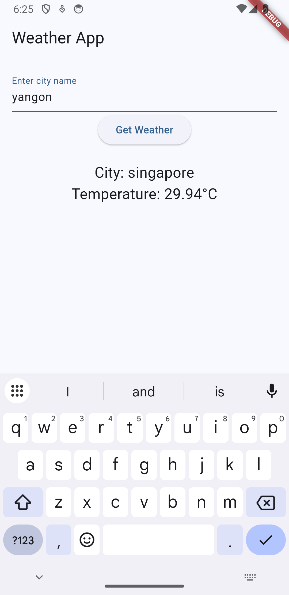
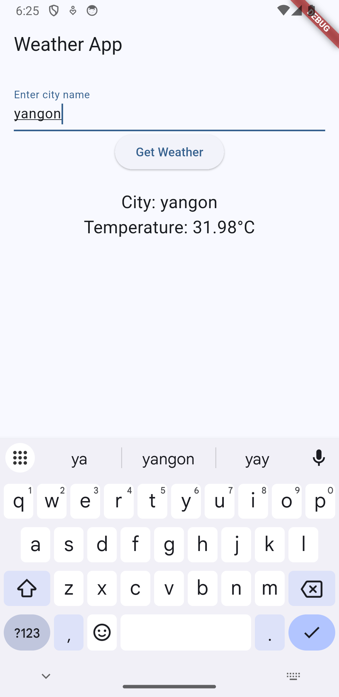

# 🌤️ Weather App with HydratedCubit (Flutter)

This is a simple weather app built using **Flutter**, **HydratedCubit**, and the **OpenWeatherMap API**.  
It demonstrates how to fetch data from an API and **persist state across app restarts** using `hydrated_bloc`.

---

## 🔧 Features

- 🔍 Search weather by **city name**
- 💾 **State caching** with HydratedCubit
- 🌐 Weather data from OpenWeatherMap API
- 📱 Clean and responsive UI

---

## 📸 Screenshots

| Search City | Weather Result |
|-------------|----------------|
|  |  |

> Add screenshots in `screenshots/` folder and update image paths.

---

## 🚀 Getting Started

1. Clone this repo

```bash
git clone https://github.com/your-username/weather_hydrated_cubit.git
cd weather_hydrated_cubit
```

2. Install packages
```bash
flutter pub get
```

3. Run the app
```bash
flutter run
```

---

🔑 API Key Setup
This project uses OpenWeatherMap 
You can get a free key from: https://openweathermap.org/appid
Replace your API key in weather_cubit.dart:
```bash
final apiKey = 'YOUR_API_KEY_HERE';
```

---
🗂️ Project Structure
```bash
lib/
│
├── weather_cubit.dart        # Logic & API call
├── weather_state.dart        # Serializable state for HydratedCubit
├── weather_screen.dart       # UI
└── main.dart                 # Entry point & HydratedBloc setup
```

---

🧱 Built With
- Flutter
- HydratedBloc
- OpenWeatherMap API